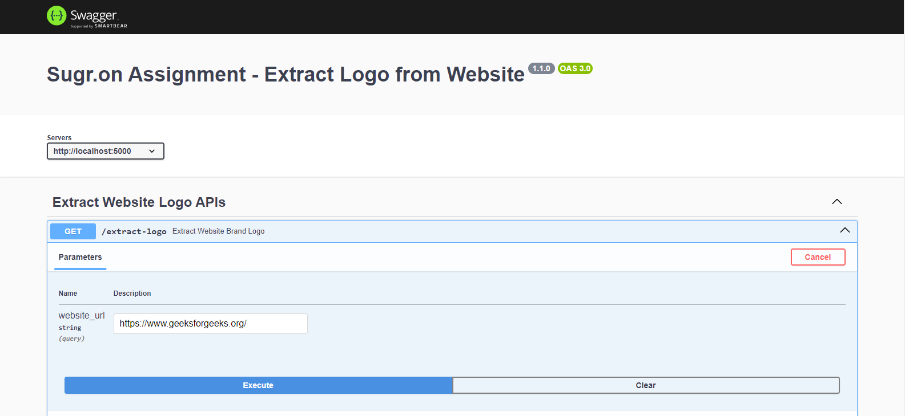
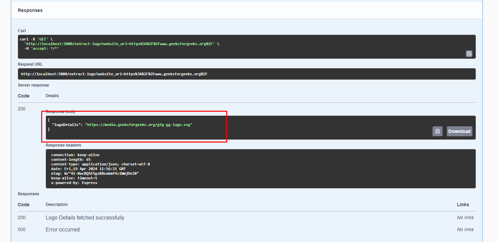

# Sugr.one Assignment Details

Created an API where we need to pass website_url and our code will return the brand logo or header logo in the response

## How to run the application
 #### npm install
 #### node app.js

## How to Get Logo
  #### open localhost:5000/extract-logo
  #### enter website_url
  #### Execute

  #### Response
  

## Modules & Packages Implemented
 ### Routes
 ### Controller
 ### Services
 ### Logger
 ### Utils
 ### Swagger
 ###  express, dotenv, puppeteer, swagger